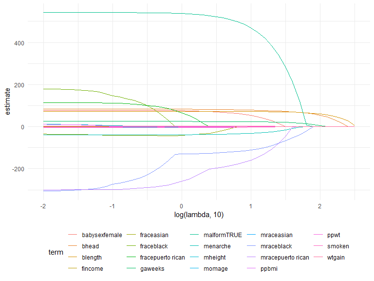
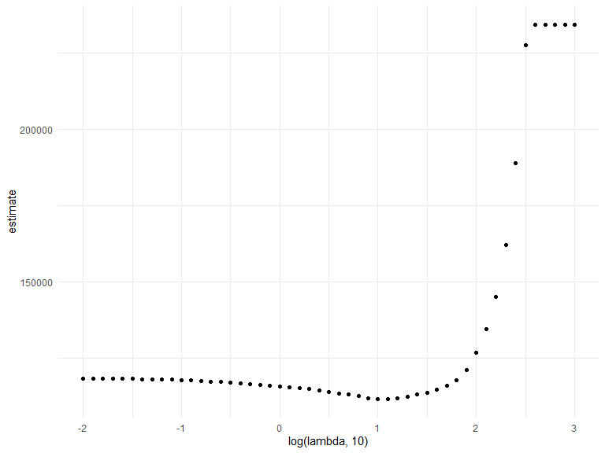
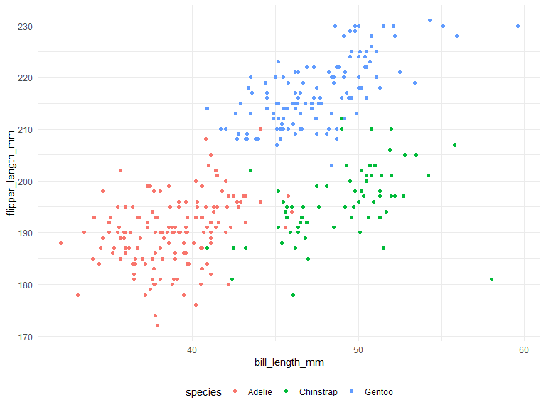
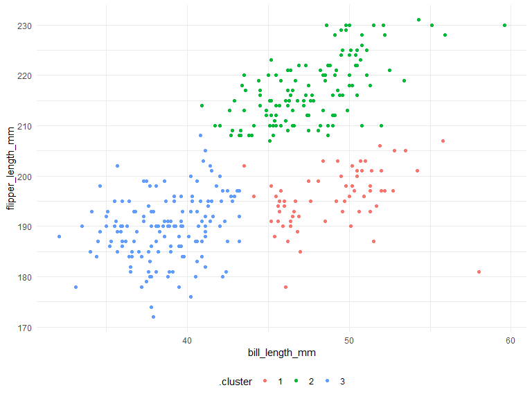

statistical learning
================
Sitian Zhou
2023-12-07

## LASSO

``` r
set.seed(11)
```

``` r
bwt_df = 
  read_csv("data/birthweight.csv") |> 
  janitor::clean_names() |>
  mutate(
    babysex = as.factor(babysex),
    babysex = fct_recode(babysex, "male" = "1", "female" = "2"),
    frace = as.factor(frace),
    frace = fct_recode(
      frace, "white" = "1", "black" = "2", "asian" = "3", 
      "puerto rican" = "4", "other" = "8"),
    malform = as.logical(malform),
    mrace = as.factor(mrace),
    mrace = fct_recode(
      mrace, "white" = "1", "black" = "2", "asian" = "3", 
      "puerto rican" = "4")) |> 
  sample_n(200)
```

    ## Rows: 4342 Columns: 20
    ## ── Column specification ────────────────────────────────────────────────────────
    ## Delimiter: ","
    ## dbl (20): babysex, bhead, blength, bwt, delwt, fincome, frace, gaweeks, malf...
    ## 
    ## ℹ Use `spec()` to retrieve the full column specification for this data.
    ## ℹ Specify the column types or set `show_col_types = FALSE` to quiet this message.

``` r
x = model.matrix(bwt ~ ., bwt_df)[, -1]
y = bwt_df |> pull(bwt)
```

``` r
lambda = 10^(seq(3, -2, -0.1))
lasso_fit = 
  glmnet(x, y, lambda = lambda)

lasso_cv = 
  cv.glmnet(x, y, lambda = lambda)
lambda_opt = lasso_cv$lambda.min
log(lambda_opt, 10)
```

    ## [1] 1.1

Let’s look at lasso results

``` r
lasso_fit |> 
  broom::tidy() |>
  filter(step == 15)
```

    ## # A tibble: 9 × 5
    ##   term               step  estimate lambda dev.ratio
    ##   <chr>             <dbl>     <dbl>  <dbl>     <dbl>
    ## 1 (Intercept)          15 -3291.      39.8     0.581
    ## 2 bhead                15    69.6     39.8     0.581
    ## 3 blength              15    69.0     39.8     0.581
    ## 4 gaweeks              15    19.1     39.8     0.581
    ## 5 malformTRUE          15   213.      39.8     0.581
    ## 6 menarche             15    -9.60    39.8     0.581
    ## 7 mraceblack           15   -52.2     39.8     0.581
    ## 8 mracepuerto rican    15    -2.92    39.8     0.581
    ## 9 wtgain               15     0.400   39.8     0.581

``` r
lasso_fit |> 
  broom::tidy() |>
  select(term, lambda, estimate) |> 
  filter(term != "(Intercept)") |> 
  complete(term, lambda, fill = list(estimate = 0)) |> 
  ggplot(aes(x = log(lambda, 10), y = estimate, color = term, group = term)) +
  geom_path()
```



``` r
lasso_fit |> 
  broom::tidy() |>
  filter(step == 20)
```

    ## # A tibble: 12 × 5
    ##    term               step  estimate lambda dev.ratio
    ##    <chr>             <dbl>     <dbl>  <dbl>     <dbl>
    ##  1 (Intercept)          20 -3659.      12.6     0.627
    ##  2 babysexfemale        20    46.2     12.6     0.627
    ##  3 bhead                20    77.9     12.6     0.627
    ##  4 blength              20    71.8     12.6     0.627
    ##  5 fincome              20     0.253   12.6     0.627
    ##  6 gaweeks              20    23.1     12.6     0.627
    ##  7 malformTRUE          20   447.      12.6     0.627
    ##  8 menarche             20   -29.4     12.6     0.627
    ##  9 mraceblack           20  -105.      12.6     0.627
    ## 10 mracepuerto rican    20  -145.      12.6     0.627
    ## 11 smoken               20    -2.62    12.6     0.627
    ## 12 wtgain               20     2.32    12.6     0.627

Show the CV results

``` r
lasso_cv |> 
  broom::tidy() |> 
  ggplot(aes(x = log(lambda, 10), y = estimate)) +
  geom_point()
```



## Penguin

``` r
library(palmerpenguins)

data("penguins")

penguins |> 
  ggplot(aes(x = bill_length_mm, y = flipper_length_mm, color = species)) + 
  geom_point()
```



``` r
penguins = 
  penguins |> 
  select(species, bill_length_mm, flipper_length_mm) |> 
  drop_na()

kmeans_fit = 
  penguins |> 
  select(-species) |> 
  # standardize the axis
  scale() |> 
  kmeans(centers = 3)

penguins |> 
  broom::augment(kmeans_fit, data = _) |> 
  ggplot(aes(x = bill_length_mm, y = flipper_length_mm, color = .cluster)) +
  geom_point()
```


